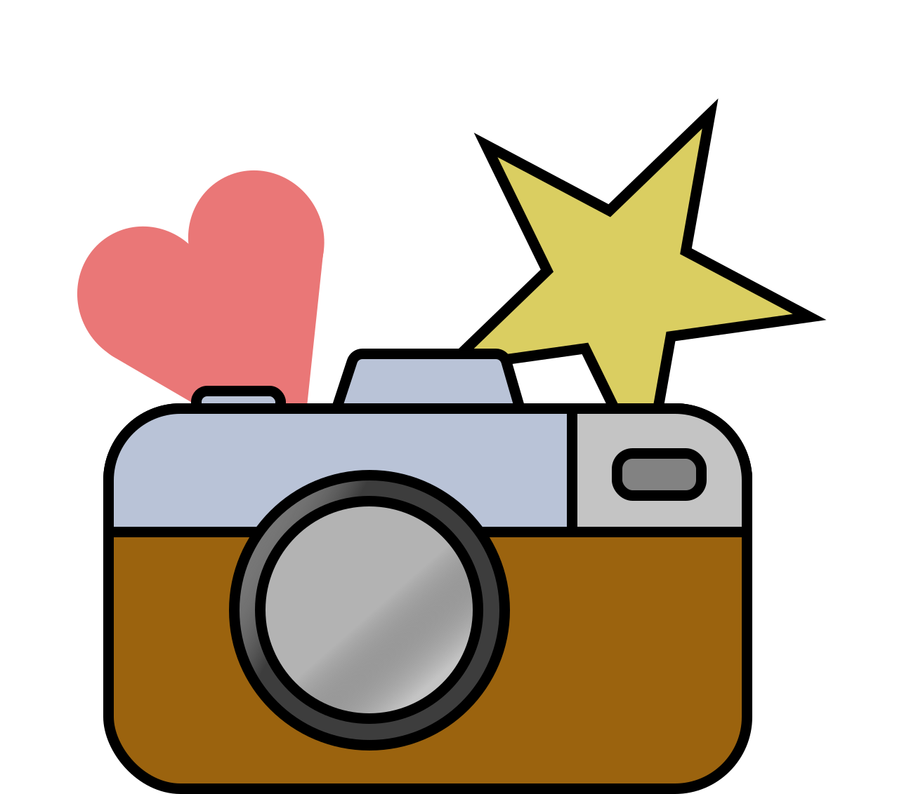

  

<h1 align="center">
  Photo Favorite
</h1>

An app to learn React Native. Used at [André Kovac](https://www.andrekovac.com/)'s workshops.

    

- Tap on Photos to see the Authors and tap on the Star to favorite (or un-favorite) photos.

## Test the published App

1. Install the [Expo Go App](https://expo.io/tools#client) on your smartphone.

2. Go to <https://expo.io/@andrusch/PhotoFavorite> and scan the **QR code**.

  - **iPhone**: Just open the build-in Camera and point it to the QR code.
  - **Android**: Open the **Expo Go App** and in there tap on Scan QR Code

### Development

- [Setup your computer for local React Native development on your computer](./docs/run-locally.md)
- [Instructions on how to run the development build of the PhotoFavorite App locally with Expo Dev Tools](./docs/run-locally.md)

### Education

- [Overview of branches which teach different concepts of React + React Native](./docs/notable-branches.md)